# Marktstammdatenregister plotter

> Animated choropleth maps of installed wind & solar capacity in Germany,
> driven by data scraped from the public Marktstammdatenregister (MaStR).

| Wind | PV (≥ 49 kW) |
|---|---|
| 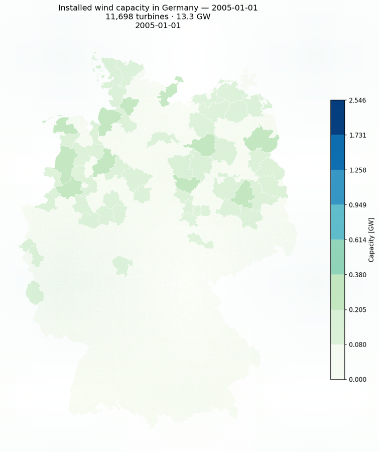 | 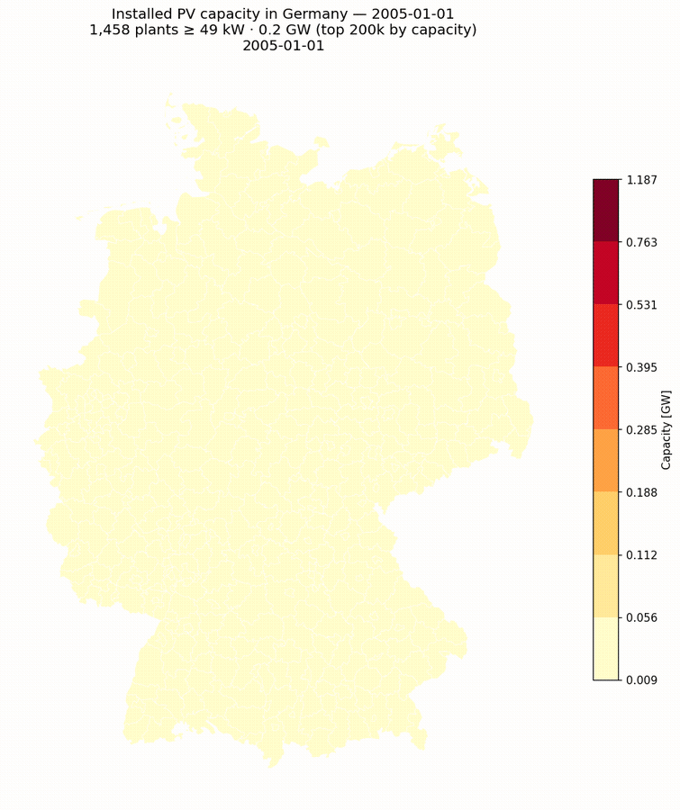 |

*Installed wind (left, 42 495 turbines / 63 GW) and PV (right, top 200 000
plants ≥ 49 kW / 58 GW) capacity per Kreis, 2005 → 2025. 21 yearly frames from
the live registry, fixed Jenks bins so colors stay comparable across years.*

[](https://maykthewessen.github.io/marktstammdatenplotter/)
[](https://www.python.org/)
[](https://www.marktstammdatenregister.de/)

> [!WARNING]
> Research-quality code — designed to run once. Most of it is AI-generated and
> occasionally very verbose. Nothing has been cleaned up. Good luck.

---

## What it does

The MaStR registry contains every grid-connected electricity-generating unit in
Germany — millions of solar panels, tens of thousands of wind turbines, plus
hydro, biomass, gas and more. Each record carries an install date, a capacity
in kW, geographic coordinates, and a pile of enum-encoded metadata.

This repo:

1. **scrapes** the MaStR public JSON API (`parser.py` decodes the rows),
2. **joins** turbines to German county polygons extracted from OSM,
3. **renders** one choropleth PNG per month from the year 2000 to today, and
4. **assembles** the frames into an animated GIF with `ffmpeg`.

### Pipeline at a glance

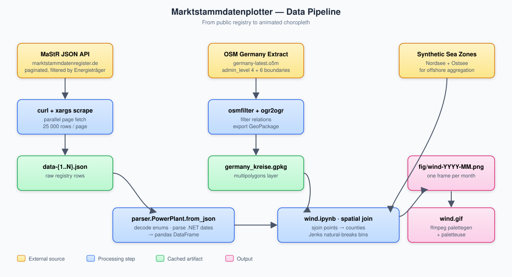

### Module architecture

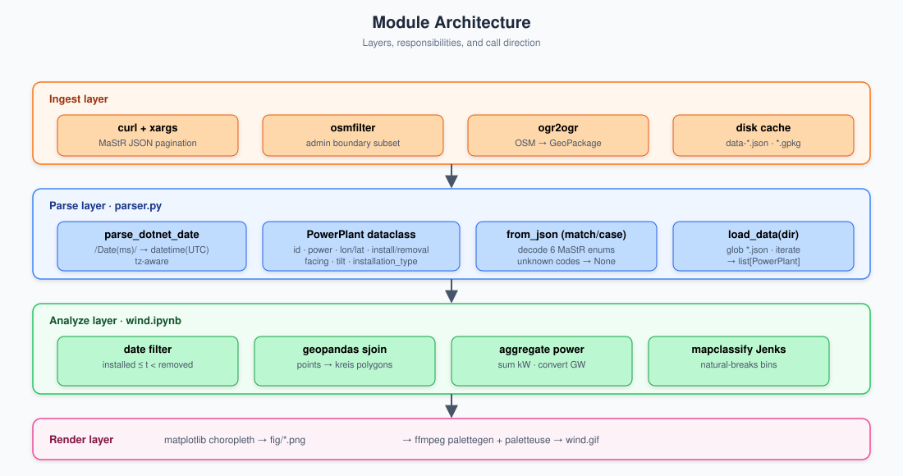

### Frame loop

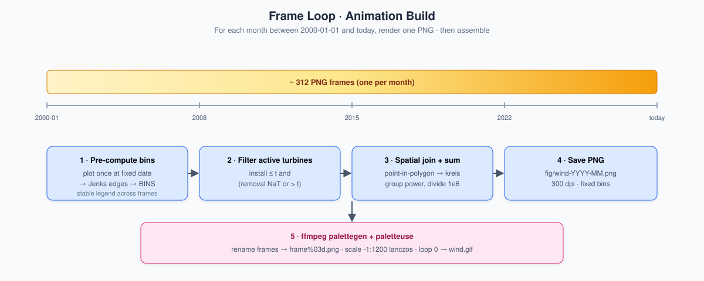

---

## Interactive notebooks

Two [marimo](https://marimo.io) reactive notebooks ship with the repo, plus
their pre-rendered HTML exports in `docs/`:

| Notebook | Source | Static HTML | Controls |
|---|---|---|---|
| **PV explorer** | [`pv.py`](pv.py) | [`docs/pv.html`](docs/pv.html) | date · installation type · bin count · colormap |
| **Wind explorer** | [`wind.py`](wind.py) | [`docs/wind.html`](docs/wind.html) | date · onshore/offshore · bin count · colormap |

```bash
python -m marimo edit pv.py            # reactive editor
python -m marimo run wind.py           # read-only app
python -m marimo export html pv.py -o docs/pv.html
```

When no `data-*.json` or `germany_kreise.gpkg` are present, both notebooks fall
back to a synthetic demo dataset so they always render.

### Sample renders (real MaStR data)

Generated from a live scrape (May 2026) of the public Marktstammdatenregister
API. **Wind** uses the full registry slice (42 495 turbines, every Kreis
covered). **PV** uses the top 50 000 utility-scale plants sorted by capacity
(`Bruttoleistung-desc`) — every plant ≥ 200 kW, capturing ≈ 70 GW of
installed PV (the bulk of Germany's commercial + ground-mount fleet). Rooftop
balcony solar (the long tail of 6 M plants below 200 kW) is excluded.

| | |
|---|---|
|  |  |
| 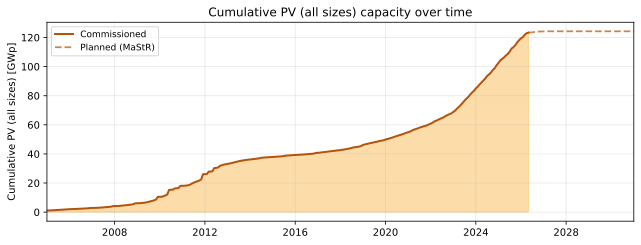 | 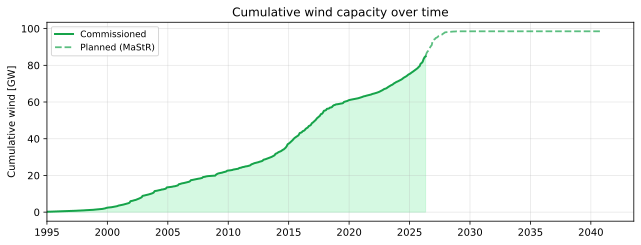 |

> **2025-01-01 snapshot · real data:** 31 404 wind turbines active, 63 GW total
> installed. PV map covers the 50 000 plants ≥ 200 kW — 68.8 GW combined.

### Installed capacity by Bundesland

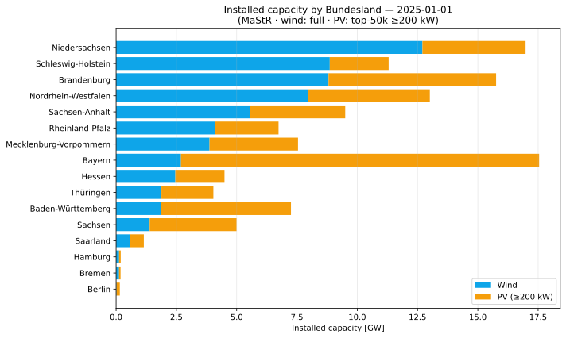

Niedersachsen leads onshore wind (12.7 GW). Bayern leads utility-scale PV
(12.0 GW). Schleswig-Holstein and Brandenburg both top 8 GW wind. The five
biggest Bundesländer carry ~70 % of national capacity.

### Who owns Germany's grid?

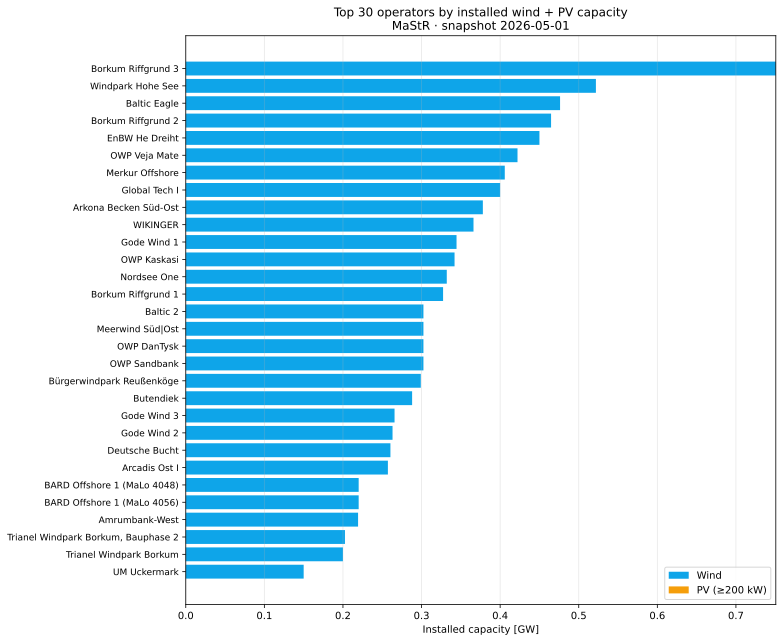

Top 30 by combined wind + PV. Offshore project vehicles dominate the very top
(DanTysk Sandbank, EnBW Hohe See, Baltic Eagle, Borkum Riffgrund 2…) because
every farm is its own LLC. Consolidating by parent would put RWE, Iberdrola
and Ørsted at the top.

### Offshore wind detail

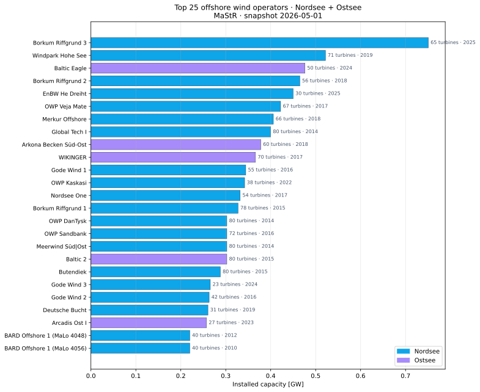

1 637 turbines / 9.2 GW offshore — 7.4 GW Nordsee + 1.8 GW Ostsee. MaStR
anonymises offshore coordinates, so this chart groups by operator instead of
mapping individual turbines.

### Energy-type mix

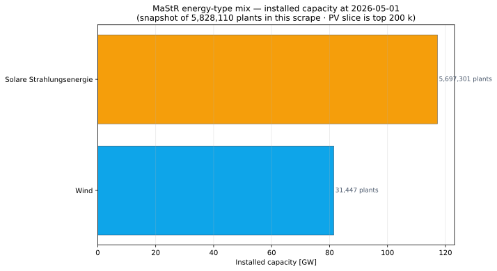

All registered electricity-generating units in this scrape, by `Energietraeger`.
Coal (Braunkohle + Steinkohle, 31 GW) still rivals utility-scale PV (58 GW).
Erdgas (36 GW) carries most of the peaking load.

### Capacity added during 2024

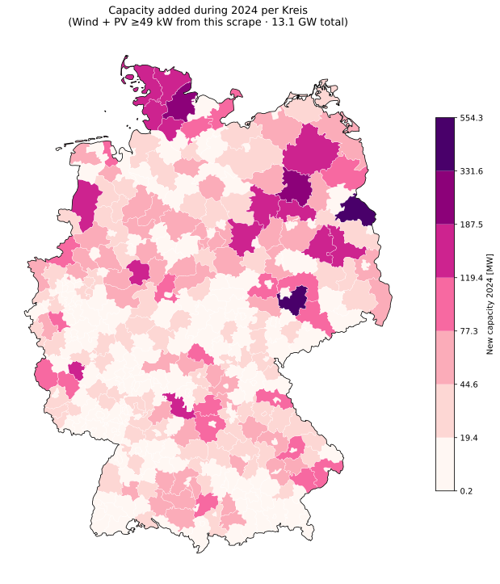

Where Germany actually installed new wind + PV (≥ 49 kW) during 2024 — 13.4 GW
in this scrape. Leipziger Land alone added 565 MW (utility solar in the
former-lignite belt).

### Build-out per Bundesland

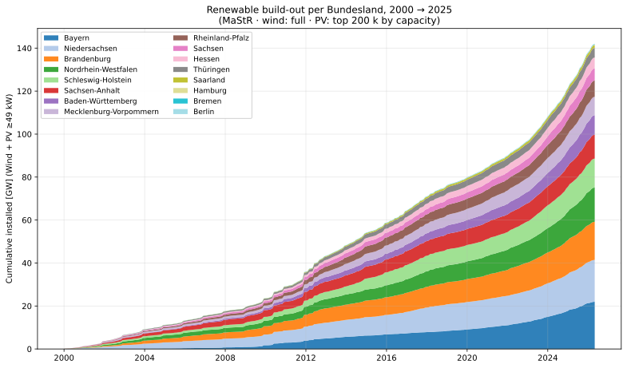

Cumulative installed capacity per state since 2000. Bayern leads at 22 GW
(driven by PV), Niedersachsen second at 19 GW (driven by wind), Brandenburg
third at 18 GW (mixed).

### PV by installation type

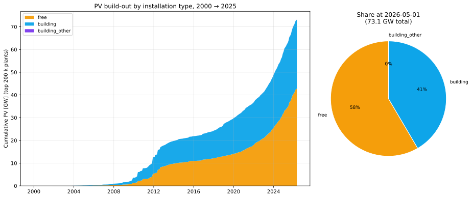

16 000 free-standing utility parks carry ~ 43 GW. 184 000 building-mounted
commercial rooftops carry ~ 30 GW. The under-49 kW residential / balcony long
tail (millions of plants, ~ 30 GW total) is excluded from this scrape.

---

## Quickstart

```bash
# 1. Install deps (pixi/conda recommended)
pixi add geopandas pandas numpy matplotlib mapclassify pyogrio shapely

# 2. Scrape registry rows (writes data-1.json ... data-7.json)
seq 7 | xargs -P 4 -I{} curl --get \
  'https://www.marktstammdatenregister.de/MaStR/Einheit/EinheitJson/GetErweiterteOeffentlicheEinheitStromerzeugung' \
  --data-urlencode 'sort=' \
  --data-urlencode 'page={}' \
  --data-urlencode 'pageSize=25000' \
  --data-urlencode 'group=' \
  --data-urlencode 'filter=Energieträger~neq~\'2495\'~and~Energieträger~neq~\'2496\'' \
  --data-urlencode 'forExport=true' -o data-{}.json

# 3. Build county polygons (one-time)
osmfilter germany-latest.o5m \
  --keep-nodes="boundary=administrative and ( admin_level=6 or admin_level=4 )" \
  --keep-ways="boundary=administrative and ( admin_level=6 or admin_level=4 )" \
  --keep-relations="boundary=administrative and ( admin_level=6 or admin_level=4 )" \
  --drop-version --drop-author \
  -o=germany_admin_levels_4_6.osm
ogr2ogr -f GPKG germany_kreise.gpkg germany_admin_levels_4_6.osm \
  -sql "SELECT name, admin_level, boundary FROM multipolygons \
        WHERE boundary = 'administrative' \
        AND (admin_level = '6' \
             OR (admin_level = '4' AND name IN ('Berlin','Hamburg','Bremen')))" \
  -nlt MULTIPOLYGON -overwrite -nln multipolygons

# 4. Render frames
jupyter nbconvert --to notebook --execute wind.ipynb --output wind.executed.ipynb

# 5. Assemble GIF — see "Animation" section below
```

---

## Getting Marktstammdatenregister data

Yes, the registry offers a full XML export. But the API filters server-side and
returns JSON instead of XML, so this repo scrapes that instead:

```bash
seq 7 | xargs -P 4 -I{} curl --get \
  'https://www.marktstammdatenregister.de/MaStR/Einheit/EinheitJson/GetErweiterteOeffentlicheEinheitStromerzeugung' \
  --data-urlencode 'sort=' \
  --data-urlencode 'page={}' \
  --data-urlencode 'pageSize=25000' \
  --data-urlencode 'group=' \
  --data-urlencode 'filter=Energieträger~neq~\'2495\'~and~Energieträger~neq~\'2496\'' \
  --data-urlencode 'forExport=true' -o data-{}.json
```

The `filter` excludes two Energieträger codes (2495, 2496) — both PV — so the
default scrape covers wind, biomass, hydro, gas, etc. ~169 k rows. Rate-limit
yourself; the API gets slow under heavy load.

### Scraping PV separately

The PV slice of the registry holds **6.1 M plants** (rooftop, balcony, ground).
The API returns 25 000 rows per page, so a full pull is ~245 pages and ≈24 GB
of JSON — usually not what you want. Two practical scopes:

```bash
# "Top-N by capacity" — 50 k largest plants (~200 MB).
# Sort = Bruttoleistung-desc puts the 200 MW utility parks first; page 2
# bottoms out around 200 kW. Captures ~70 GW = bulk of Germany's PV fleet,
# without the 6 M rooftop/balcony long tail.
mkdir -p data-pv
seq 2 | xargs -P 2 -I{} curl --get \
  'https://www.marktstammdatenregister.de/MaStR/Einheit/EinheitJson/GetErweiterteOeffentlicheEinheitStromerzeugung' \
  --data-urlencode 'sort=Bruttoleistung-desc' \
  --data-urlencode 'page={}' \
  --data-urlencode 'pageSize=25000' \
  --data-urlencode 'group=' \
  --data-urlencode "filter=Energieträger~eq~'2495'" \
  --data-urlencode 'forExport=true' \
  -o data-pv/data-{}.json
```

> **Filter quirk** — MaStR silently drops the second clause when ANDed with a
> different field, e.g. `Energieträger~eq~'2495'~and~ArtDerSolaranlageId~eq~'852'`
> returns the same row count as `Energieträger~eq~'2495'` alone. Filter
> client-side after loading if you need a narrower slice.

### Decoding the rows

MaStR fields are numeric enum codes (e.g. `698` for "Süd-Ost", `853` for
"building"). `parser.py` decodes the six enums that matter for plotting:

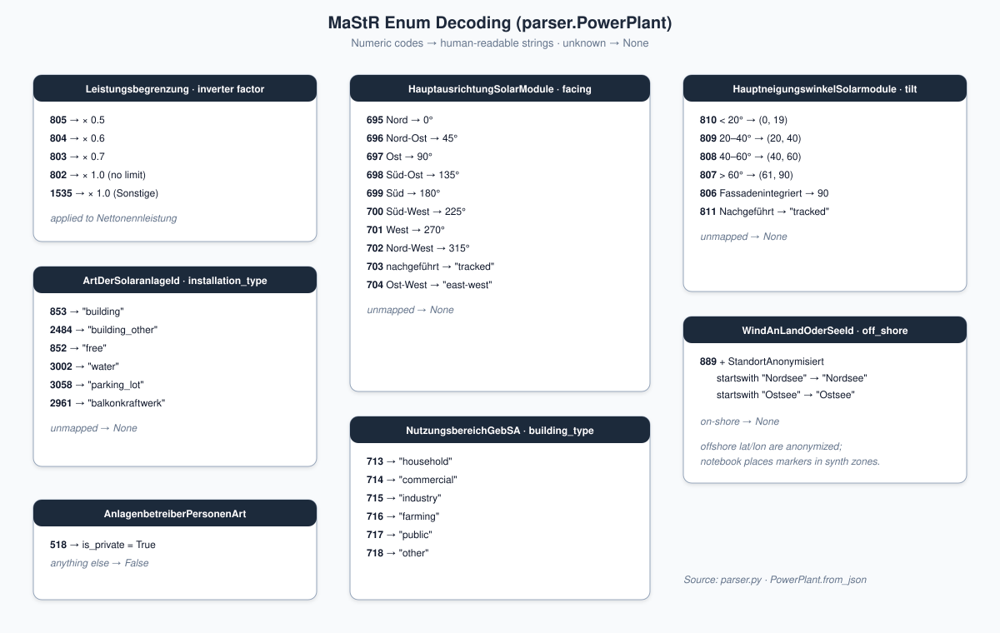

Unknown codes become `None`. The registry adds codes over time, so check
`parser.PowerPlant.from_json` after large data refreshes.

---

## Getting map data

County boundaries come from a Germany OSM extract (e.g.
[geofabrik.de](https://download.geofabrik.de/europe/germany.html)):

```bash
osmfilter germany-latest.o5m \
  --keep-nodes="boundary=administrative and ( admin_level=6 or admin_level=4 )" \
  --keep-ways="boundary=administrative and ( admin_level=6 or admin_level=4 )" \
  --keep-relations="boundary=administrative and ( admin_level=6 or admin_level=4 )" \
  --drop-version --drop-author \
  -o=germany_admin_levels_4_6.osm

ogr2ogr -f GPKG germany_kreise.gpkg germany_admin_levels_4_6.osm \
  -sql "SELECT name, admin_level, boundary FROM multipolygons \
        WHERE boundary = 'administrative' \
        AND (admin_level = '6' \
             OR (admin_level = '4' AND name IN ('Berlin','Hamburg','Bremen')))" \
  -nlt MULTIPOLYGON -overwrite -nln multipolygons
```

`admin_level=6` is `Kreis` / `Landkreis`. The three city-states (Berlin,
Hamburg, Bremen) are `admin_level=4`, so they get pulled in by name.

> **Gotcha** — Hamburg's MultiPolygon contains "Nationalpark Hamburgisches
> Wattenmeer" as part-id 2. The notebook strips it explicitly. If you regenerate
> the GPKG from a newer OSM extract, double-check the part-id has not shifted.

---

## Turning results into GIFs

It is surprisingly hard to turn a folder of PNGs with names like `wind-2007-04.png`
into a video with `ffmpeg`, which insists on `frame%03d.png`. The block below
renames everything to a tmpdir first, then runs `palettegen` + `paletteuse` for
a clean palette:

```fish
set -l file wind
set -l frames_to_repeat 120
mktemp -d | read -l temp_dir
and cp "$file"-*.png $temp_dir
and begin
    set -l i 1
    set -l last_frame_path ""
    for f in (ls "$temp_dir/$file"*.png | sort)
        mv $f (printf "%s/frame%03d.png" $temp_dir $i)
        set last_frame_path (printf "%s/frame%03d.png" $temp_dir $i)
        set i (math $i + 1)
    end
    set -l current_duplicate_index $i
    for j in (seq 1 $frames_to_repeat)
        cp "$last_frame_path" (printf "%s/frame%03d.png" $temp_dir $current_duplicate_index)
        set current_duplicate_index (math $current_duplicate_index + 1)
    end
end
and ffmpeg -framerate 30 -i "$temp_dir/frame%03d.png" \
    -vf "scale=-1:1200:flags=lanczos,split[s0][s1];[s0]palettegen[p];[s1][p]paletteuse=dither=none" \
    -loop 0 -y "$file".gif
and rm -rf "$temp_dir"
```

The final-frame repetition keeps the last month on screen for ~4 seconds before
the GIF loops. Drop `-loop 0` if you want a one-shot.

> **Fun fact**: This whole renaming dance exists because PNGs have no timestamp
> metadata. JPGs with EXIF would just work with `ffmpeg`'s glob pattern.

---

## Layout

| File / dir | Purpose |
|------------|---------|
| `parser.py` | `PowerPlant` dataclass + JSON-to-record decoder |
| `mastr_plot.py` | Shared helpers (load, aggregate, choropleth) + synthetic demo data |
| `pixi.toml` | Reproducible env: `pixi install` then `pixi run pv-edit` / `wind-edit` / `docs-build` |
| `pv.py` | Marimo notebook — interactive PV explorer |
| `wind.py` | Marimo notebook — interactive wind explorer |
| `wind.ipynb` | Original Jupyter notebook: load → join → plot → save frames |
| `fig/` | Rendered PNG/GIF outputs (gitignored), plus pipeline + sample SVGs |
| `docs/` | Read-the-Docs–style site published at [maykthewessen.github.io/marktstammdatenplotter](https://maykthewessen.github.io/marktstammdatenplotter/) |
| `CLAUDE.md` | Conventions for Claude Code agents |
| `CITATION.cff` | Citation metadata for the software + upstream datasets |
| `tests/` | `pytest` suite covering `parser.py` enum decoders (52 tests) |
| `scripts/` | CI helpers: `render_samples.py`, `render_wind_gif.py`, `build_kreise_json.py`, `build_downloads.py` |
| `docs/data/` | Bulk downloads — `mastr-snapshot.parquet` + CSV.gz mirrors |

---

## Credits

Forked from [emmericp/marktstammdatenplotter](https://github.com/emmericp/marktstammdatenplotter).
Data © Marktstammdatenregister, Bundesnetzagentur. OSM © OpenStreetMap
contributors.
