# Marktstammdatenregister plotter

> Animated choropleth maps of installed wind & solar capacity in Germany,
> driven by data scraped from the public Marktstammdatenregister (MaStR).

| Wind | PV (all sizes) |
|---|---|
| 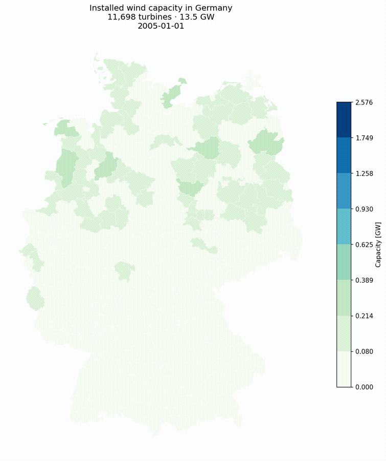 | 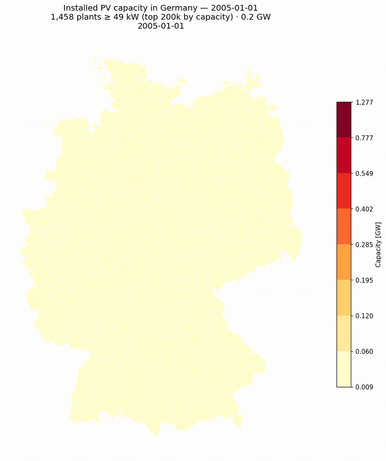 |

*Installed wind (left) and PV (right, full registry ~4.86 M plants, all sizes) capacity
per Kreis, 2005 → May 2026. 22 yearly frames plus a final May 2026 YTD
snapshot from the live registry. Fixed Jenks bins so colors stay comparable
across years. Available as `.gif` (universal autoplay) and `.mp4`
(LinkedIn-native, ~30 % smaller, sharper) — see [`fig/`](fig/).*

[](https://maykthewessen.github.io/marktstammdatenplotter/)
[](https://github.com/MaykThewessen/marktstammdatenplotter/actions/workflows/refresh-docs.yml)
[](tests/test_parser.py)
[](https://www.python.org/)
[](https://pixi.sh)
[](https://www.marktstammdatenregister.de/)
[](https://marimo.io)

> [!WARNING]
> Research-quality code — designed to run once. Most of it is AI-generated and
> occasionally very verbose. Nothing has been cleaned up. Good luck.

---

## What it does

The MaStR registry contains every grid-connected electricity-generating unit in
Germany — millions of solar panels, tens of thousands of wind turbines, plus
hydro, biomass, gas and more. Each record carries an install date, a capacity
in kW, geographic coordinates, and a pile of enum-encoded metadata.

This repo:

1. **scrapes** the MaStR public JSON API (`parser.py` decodes the rows),
2. **joins** turbines to German county polygons extracted from OSM,
3. **renders** one choropleth PNG per month from the year 2000 to today, and
4. **assembles** the frames into an animated GIF with `ffmpeg`.

### Pipeline at a glance


### Module architecture


### Frame loop


---

## Interactive notebooks

Two [marimo](https://marimo.io) reactive notebooks ship with the repo, plus
their pre-rendered HTML exports in `docs/`:

| Notebook | Source | Static HTML | Controls |
|---|---|---|---|
| **PV explorer** | [`pv.py`](pv.py) | [`docs/pv.html`](docs/pv.html) | date · installation type · bin count · colormap |
| **Wind explorer** | [`wind.py`](wind.py) | [`docs/wind.html`](docs/wind.html) | date · onshore/offshore · bin count · colormap |

```bash
python -m marimo edit pv.py            # reactive editor
python -m marimo run wind.py           # read-only app
python -m marimo export html pv.py -o docs/pv.html
```

When no `data-*.json` or `germany_kreise.gpkg` are present, both notebooks fall
back to a synthetic demo dataset so they always render.

### Sample renders (real MaStR data)

Generated from the open-MaStR Zenodo full registry dump (cutoff 2025-02-09)
merged with the MaStR API delta through May 2026. **Wind**: full registry
(~42 k turbines, every Kreis covered). **PV**: full registry (~4.86 M
plants, including all rooftop and balcony solar — no power threshold).
**BESS**: top 200 k storage units by installed power (covers Pumpspeicher
down to ~10 kW home batteries).

| | |
|---|---|
|  |  |
|  |  |

> **2026-05-01 snapshot · real data:** 32 107 wind turbines active, 79.7 GW
> total installed. PV: full registry, ~4.86 M plants. Offshore: 1 732 turbines
> · 10.4 GW (Nordsee + Ostsee). BESS: 193 599 batteries active · 6.49 GW / 9.4 GWh.

### Per-unit size-bin distribution

Where the GW + GWh actually sit when you sort by single-unit nameplate
power. Same bins used for all three technologies — wind almost entirely
1-10 MW; PV spread across 10 kW – 100 MW; BESS bimodal (residential
10-100 kW + utility 100-1000 MW).

| Wind | PV |
|---|---|
| 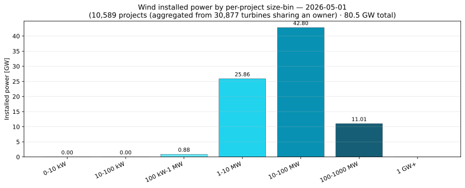 | 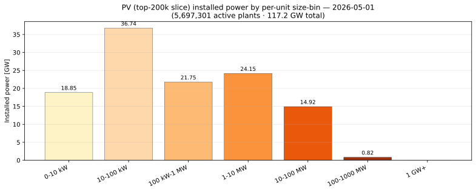 |

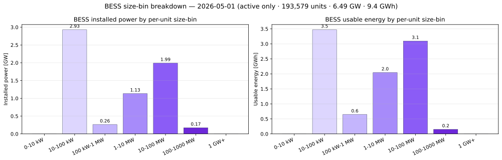

### Installed capacity by Bundesland


Niedersachsen leads onshore wind (12.7 GW). Bayern leads utility-scale PV
(12.0 GW). Schleswig-Holstein and Brandenburg both top 8 GW wind. The five
biggest Bundesländer carry ~70 % of national capacity.

### Who owns Germany's grid?


Top 30 by combined wind + PV. Offshore project vehicles dominate the very top
(DanTysk Sandbank, EnBW Hohe See, Baltic Eagle, Borkum Riffgrund 2…) because
every farm is its own LLC. Consolidating by parent would put RWE, Iberdrola
and Ørsted at the top.

### Offshore wind detail


1 732 turbines / 10.4 GW offshore — 8.6 GW Nordsee + 1.8 GW Ostsee. MaStR
anonymises offshore coordinates, so this chart groups by operator instead of
mapping individual turbines.

### Energy-type mix


All registered electricity-generating units in this scrape, by `Energietraeger`.
Coal (Braunkohle + Steinkohle, 31 GW) is now decisively below utility-scale PV (73 GW).
Erdgas (36 GW) carries most of the peaking load.

### PV orientation

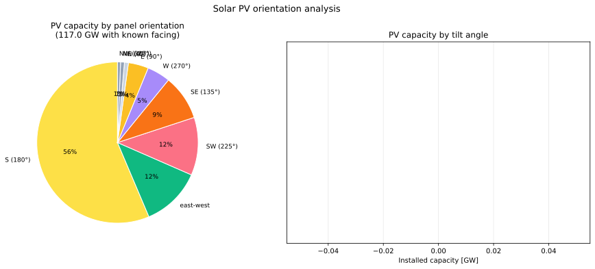

South-facing dominates at 62 % of installed PV; east-west flat-mount (utility
parks) is the strong second at 14 %. Trackers stay rare — only 0.5 GW. Most
plants tilt 0–19° (flat utility footprints).

#### Current fleet — orientation polar rose (May 2026)

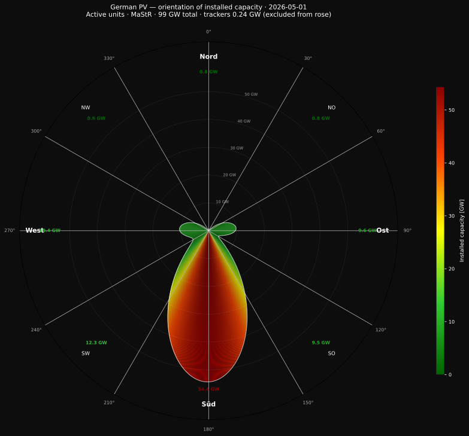

Polar rose of total installed capacity at the snapshot date. Radial distance =
GW. South (bottom) dominates at 54 GW — the elongated red lobe. SW and SO
shoulders account for another ~22 GW combined. North-facing slivers are barely
visible at under 1 GW each. Ost-West dual-pitch panels split 50/50 to the Ost
and West lobes. Trackers (0.24 GW) excluded — no fixed azimuth.

#### Orientation × commissioning year — polar heatmap

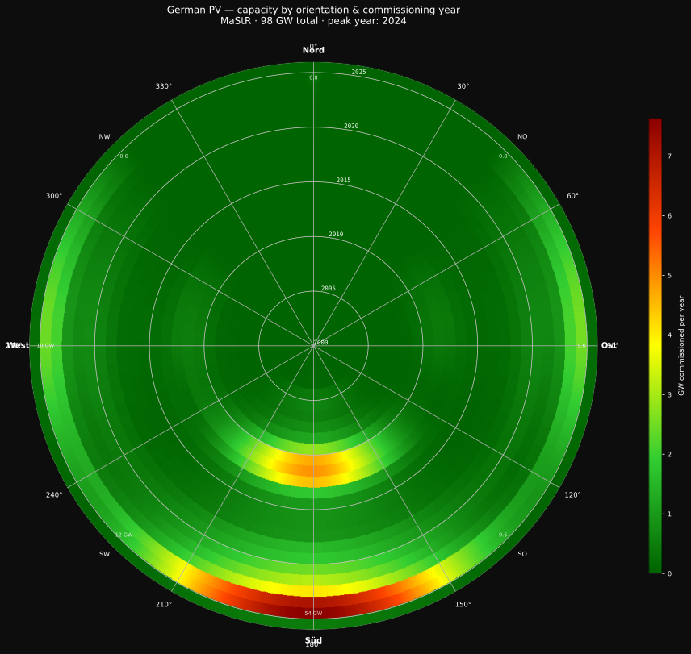

Each ring = one commissioning year (2000 → 2025, inner → outer). Color =
GW commissioned that year in that compass direction. South (bottom) is 54 GW
cumulative — roughly 70× more than North. The outer rings are darkest: the
post-2020 build-out dominated by large ground-mount arrays, which still skew
strongly south-facing. East-West split panels contribute to the Ost and West
sectors (capacity divided 50/50). Ost-West tracking (`nachgeführt`) excluded.

### Wind fleet age + repowering

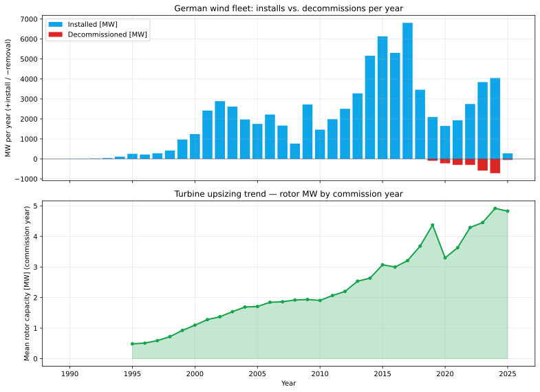

Decommission wave from 2019 onwards: first EEG cohort reaching its 20-year
boundary. Mean per-turbine MW has grown 15× since the late 90s (0.5 → 7 MW),
driven by the new 15 MW offshore class.

### Battery storage (BESS) — batteries only


MaStR carries 2.5 M storage records under `Energieträger=2496`. Below
covers **batteries only** (`Stromspeichertechnologie = "Batterie"`).
**Pumped-hydro storage gets its [own section](#pumped-hydro-storage-psh)**
because it's a fundamentally different technology and reported separately
everywhere serious.

**Snapshot 2026-05-01 (batteries, active):** 193 599 units · **6.49 GW
/ 9.4 GWh**. Pipeline (+ planned-and-permitted): **+ ~ 8 GW LSS Li-ion**
by ~ 2028.

#### Three-sector split (battery-charts.de / BVES / EASE convention)

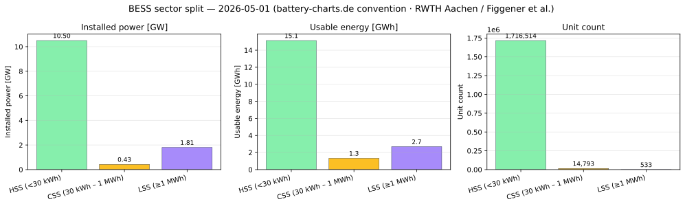

| Sector | Threshold | Batteries active 2026-05-01 |
|---|---|---|
| **HSS** Heimspeicher | < 30 kWh | 176 411 units · 2.47 GW · 2.54 GWh |
| **CSS** Gewerblich | 30 kWh – 1 MWh | 16 655 units · 0.68 GW · 1.20 GWh |
| **LSS** Großspeicher | ≥ 1 MWh | 526 units · **3.34 GW · 5.65 GWh** |

Same thresholds as [battery-charts.de](https://battery-charts.de) (RWTH
Aachen · Figgener et al.), the
[BVES](https://www.bves.de/) market monitor, the
[EASE](https://ease-storage.eu/) European Storage Market Monitor, and the
EU SET-Plan flexibility scenarios. Useful for direct cross-reference.

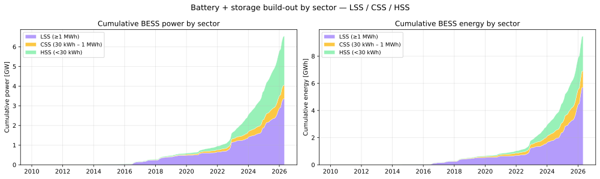

HSS is the headcount story (176k households with PV+battery).
LSS is the GW + GWh story (grid-scale Li-ion at 3.3 GW + 8 GW more in
the pipeline).

### Pumped-hydro storage (PSH)

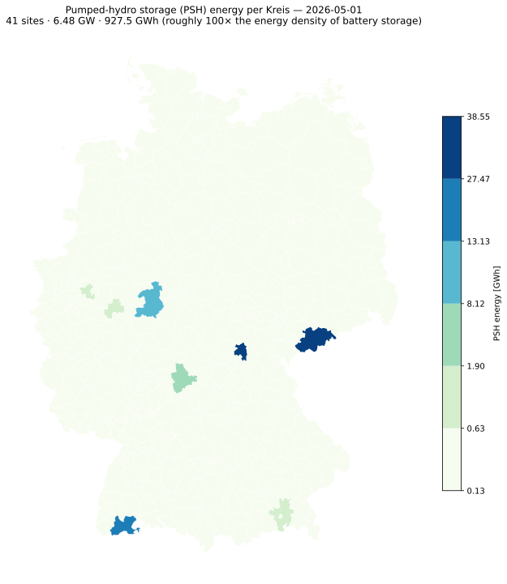

41 sites · **6.48 GW · 927.5 GWh** active at 2026-05-01 — roughly 100×
the energy density of Li-ion batteries because PSH was built for
multi-hour duration. Median duration ~ 8 h vs ~ 1 h for residential Li-ion.

| Per-state breakdown + duration | Top 15 sites |
|---|---|
| 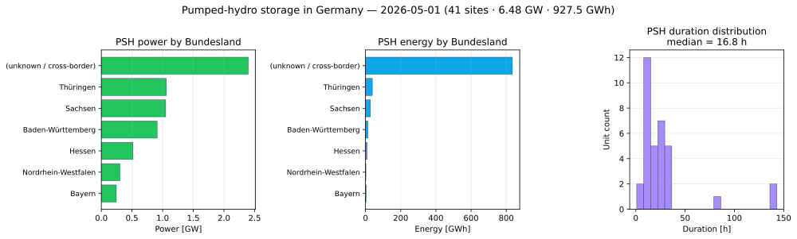 | 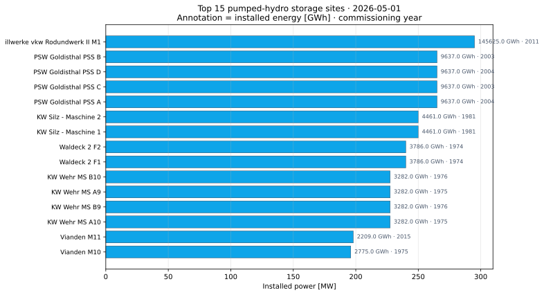 |

Goldisthal (Thüringen) alone — 4 PSS units × 265 MW × 9.64 GWh — accounts
for 1.06 GW + 38.5 GWh.

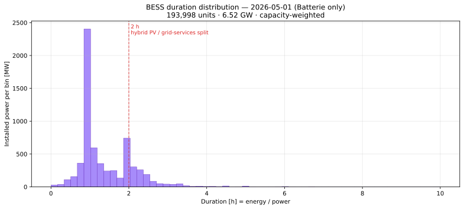

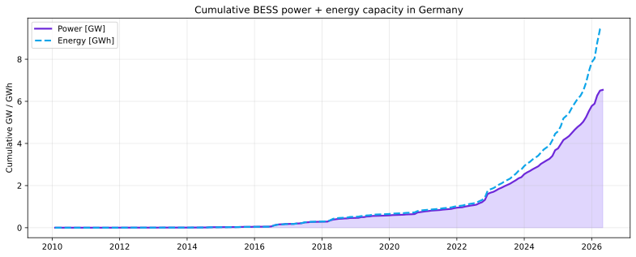

### Capacity density (MW per km²)

Absolute capacity makes large rural Kreise look more impressive than they
are. Normalising by area reshuffles the ranking — small coastal Kreise on
the wind side, small city-Kreise hosting one or two utility parks on the
PV side.

| Wind density | PV density |
|---|---|
| 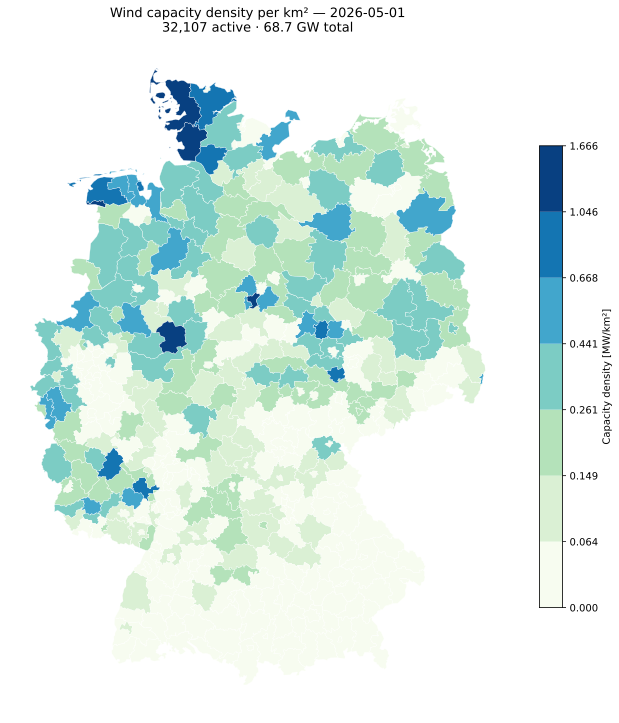 | 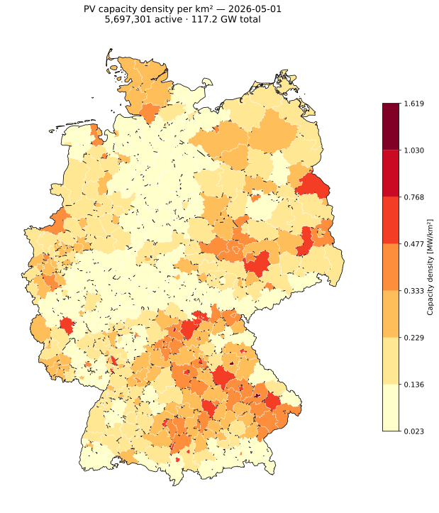 |

Top per-km² Kreise: **Dithmarschen** 1.6 MW/km² wind, **Straubing Stadt**
1.5 MW/km² PV.

### Capacity added during 2024


Where Germany actually installed new wind + PV during 2024 — 13.4 GW
in this scrape. Leipziger Land alone added 565 MW (utility solar in the
former-lignite belt).

### Build-out per Bundesland


Cumulative installed capacity per state since 2000. Bayern leads at 22 GW
(driven by PV), Niedersachsen second at 19 GW (driven by wind), Brandenburg
third at 18 GW (mixed).

### PV by installation type


16 000 free-standing utility parks carry ~ 43 GW. 184 000 building-mounted
commercial rooftops carry ~ 30 GW. Residential and balcony plants (millions
of units, ~ 30 GW) are included in the full-registry scrape.

---

## Quickstart

```bash
# 1. Install deps (pixi/conda recommended)
pixi add geopandas pandas numpy matplotlib mapclassify pyogrio shapely

# 2. Scrape registry rows (writes data-1.json ... data-7.json)
seq 7 | xargs -P 4 -I{} curl --get \
  'https://www.marktstammdatenregister.de/MaStR/Einheit/EinheitJson/GetErweiterteOeffentlicheEinheitStromerzeugung' \
  --data-urlencode 'sort=' \
  --data-urlencode 'page={}' \
  --data-urlencode 'pageSize=25000' \
  --data-urlencode 'group=' \
  --data-urlencode 'filter=Energieträger~neq~\'2495\'~and~Energieträger~neq~\'2496\'' \
  --data-urlencode 'forExport=true' -o data-{}.json

# 3. Build county polygons (one-time)
osmfilter germany-latest.o5m \
  --keep-nodes="boundary=administrative and ( admin_level=6 or admin_level=4 )" \
  --keep-ways="boundary=administrative and ( admin_level=6 or admin_level=4 )" \
  --keep-relations="boundary=administrative and ( admin_level=6 or admin_level=4 )" \
  --drop-version --drop-author \
  -o=germany_admin_levels_4_6.osm
ogr2ogr -f GPKG germany_kreise.gpkg germany_admin_levels_4_6.osm \
  -sql "SELECT name, admin_level, boundary FROM multipolygons \
        WHERE boundary = 'administrative' \
        AND (admin_level = '6' \
             OR (admin_level = '4' AND name IN ('Berlin','Hamburg','Bremen')))" \
  -nlt MULTIPOLYGON -overwrite -nln multipolygons

# 4. Render frames
jupyter nbconvert --to notebook --execute wind.ipynb --output wind.executed.ipynb

# 5. Assemble GIF — see "Animation" section below
```

---

## Getting Marktstammdatenregister data

Yes, the registry offers a full XML export. But the API filters server-side and
returns JSON instead of XML, so this repo scrapes that instead:

```bash
seq 7 | xargs -P 4 -I{} curl --get \
  'https://www.marktstammdatenregister.de/MaStR/Einheit/EinheitJson/GetErweiterteOeffentlicheEinheitStromerzeugung' \
  --data-urlencode 'sort=' \
  --data-urlencode 'page={}' \
  --data-urlencode 'pageSize=25000' \
  --data-urlencode 'group=' \
  --data-urlencode 'filter=Energieträger~neq~\'2495\'~and~Energieträger~neq~\'2496\'' \
  --data-urlencode 'forExport=true' -o data-{}.json
```

The `filter` excludes Energieträger codes `2495` (Solar / PV) and `2496`
(Speicher / storage), so the default scrape covers wind, biomass, hydro,
gas, etc. ~169 k rows. Rate-limit yourself; the API gets slow under
heavy load. For PV use `pixi run scrape-pv-top` (or `scrape-bess` for
storage) — see below.

### Scraping PV separately

The PV slice of the registry holds **~6 M plants** (rooftop, balcony, ground).
The API returns 25 000 rows per page, so a full pull is ~245 pages and ≈24 GB
of JSON — usually not what you want. The repo defaults to the open-MaStR
Zenodo full registry parquet (~4.86 M PV plants) merged with an API delta
for the live tail. For a quick top-by-capacity JSON slice use the pixi task:

```bash
pixi run scrape-pv-top   # 200 k largest plants (8 pages, ~800 MB)
```

This is `Bruttoleistung-desc` sorted — captures every plant ≥ 49 kW.

> **Filter quirk** — MaStR silently drops the second clause when ANDed with a
> different field, e.g. `Energieträger~eq~'2495'~and~ArtDerSolaranlageId~eq~'852'`
> returns the same row count as `Energieträger~eq~'2495'` alone. Filter
> client-side after loading if you need a narrower slice.

### Decoding the rows

MaStR fields are numeric enum codes (e.g. `698` for "Süd-Ost", `853` for
"building"). `parser.py` decodes the six enums that matter for plotting:


Unknown codes become `None`. The registry adds codes over time, so check
`parser.PowerPlant.from_json` after large data refreshes.

---

## Getting map data

County boundaries come from a Germany OSM extract (e.g.
[geofabrik.de](https://download.geofabrik.de/europe/germany.html)):

```bash
osmfilter germany-latest.o5m \
  --keep-nodes="boundary=administrative and ( admin_level=6 or admin_level=4 )" \
  --keep-ways="boundary=administrative and ( admin_level=6 or admin_level=4 )" \
  --keep-relations="boundary=administrative and ( admin_level=6 or admin_level=4 )" \
  --drop-version --drop-author \
  -o=germany_admin_levels_4_6.osm

ogr2ogr -f GPKG germany_kreise.gpkg germany_admin_levels_4_6.osm \
  -sql "SELECT name, admin_level, boundary FROM multipolygons \
        WHERE boundary = 'administrative' \
        AND (admin_level = '6' \
             OR (admin_level = '4' AND name IN ('Berlin','Hamburg','Bremen')))" \
  -nlt MULTIPOLYGON -overwrite -nln multipolygons
```

`admin_level=6` is `Kreis` / `Landkreis`. The three city-states (Berlin,
Hamburg, Bremen) are `admin_level=4`, so they get pulled in by name.

> **Gotcha** — Hamburg's MultiPolygon contains "Nationalpark Hamburgisches
> Wattenmeer" as part-id 2. The notebook strips it explicitly. If you regenerate
> the GPKG from a newer OSM extract, double-check the part-id has not shifted.

---

## Turning results into GIFs

It is surprisingly hard to turn a folder of PNGs with names like `wind-2007-04.png`
into a video with `ffmpeg`, which insists on `frame%03d.png`. The block below
renames everything to a tmpdir first, then runs `palettegen` + `paletteuse` for
a clean palette:

```fish
set -l file wind
set -l frames_to_repeat 120
mktemp -d | read -l temp_dir
and cp "$file"-*.png $temp_dir
and begin
    set -l i 1
    set -l last_frame_path ""
    for f in (ls "$temp_dir/$file"*.png | sort)
        mv $f (printf "%s/frame%03d.png" $temp_dir $i)
        set last_frame_path (printf "%s/frame%03d.png" $temp_dir $i)
        set i (math $i + 1)
    end
    set -l current_duplicate_index $i
    for j in (seq 1 $frames_to_repeat)
        cp "$last_frame_path" (printf "%s/frame%03d.png" $temp_dir $current_duplicate_index)
        set current_duplicate_index (math $current_duplicate_index + 1)
    end
end
and ffmpeg -framerate 30 -i "$temp_dir/frame%03d.png" \
    -vf "scale=-1:1200:flags=lanczos,split[s0][s1];[s0]palettegen[p];[s1][p]paletteuse=dither=none" \
    -loop 0 -y "$file".gif
and rm -rf "$temp_dir"
```

The final-frame repetition keeps the last month on screen for ~4 seconds before
the GIF loops. Drop `-loop 0` if you want a one-shot.

> **Fun fact**: This whole renaming dance exists because PNGs have no timestamp
> metadata. JPGs with EXIF would just work with `ffmpeg`'s glob pattern.

---

## Layout

| File / dir | Purpose |
|------------|---------|
| `parser.py` | `PowerPlant` dataclass + JSON-to-record decoder |
| `mastr_plot.py` | Shared helpers (load, aggregate, choropleth) + synthetic demo data |
| `pixi.toml` | Reproducible env: `pixi install` then `pixi run pv-edit` / `wind-edit` / `docs-build` |
| `pv.py` | Marimo notebook — interactive PV explorer |
| `wind.py` | Marimo notebook — interactive wind explorer |
| `wind.ipynb` | Original Jupyter notebook: load → join → plot → save frames |
| `fig/` | Rendered PNG/GIF outputs (gitignored), plus pipeline + sample SVGs |
| `docs/` | Read-the-Docs–style site published at [maykthewessen.github.io/marktstammdatenplotter](https://maykthewessen.github.io/marktstammdatenplotter/) |
| `CLAUDE.md` | Conventions for Claude Code agents |
| `CITATION.cff` | Citation metadata for the software + upstream datasets |
| `tests/` | `pytest` suite covering `parser.py` enum decoders (52 tests) |
| `scripts/` | CI helpers: `render_samples.py`, `render_wind_gif.py`, `build_kreise_json.py`, `build_downloads.py` |
| `docs/data/` | Bulk downloads — `mastr-snapshot.parquet` + CSV.gz mirrors |
| `CHANGELOG.md` | Notable changes per version (Keep-a-Changelog format) |
| `CONTRIBUTING.md` | How to add a chart / parser enum, style + commit rules |

---

## What this method does **not** track

The choropleths and animations cover the full PV registry (all sizes) and the
complete wind fleet, but a few categories are systematically excluded — listed
explicitly so nobody draws the wrong conclusion:

| Excluded | Why | Approx scale |
|---|---|---|
| Records with NaT `install_date` | Snapshot filter is `install_date ≤ snap` | ~ 15 k rows / 71 GW (mostly legacy conventional) |
| Records with NaN `Laengengrad` / `Breitengrad` | Spatial join drops them | ~ 76 k rows / 0.8 GW |
| Offshore turbines in choropleths | No Kreis covers open sea | 1 732 turbines / 10.4 GW *(reported separately)* |
| Battery storage (Speicher) | `Energieträger` codes 2495 + 2496 filtered out | several GW BESS |
| Heat-only plants (Wärme) | Outside Wind+PV scope | ~ 2 GW thermal |
| Plants approved but not commissioned | No `InbetriebnahmeDatum` yet | several GW pipeline |
| Behind-the-meter / unregistered Balkonkraftwerke | Registration was optional pre-2017 | ~ 0.5 GW |
| Plants decommissioned before snapshot | Removed by `removal_date > snap` filter | 3 GW cumulative since 2013 |

Offshore lat/lon: contrary to the original notebook's assumption, MaStR
*does* carry real coordinates for offshore plants. The `StandortAnonymisiert`
field is only a sea label ("Nordsee…" / "Ostsee…"). Drop the synthetic-sea
workaround if you want point-accurate offshore positions.

## Credits

Forked from [emmericp/marktstammdatenplotter](https://github.com/emmericp/marktstammdatenplotter).
Data © Marktstammdatenregister, Bundesnetzagentur. OSM © OpenStreetMap
contributors.
