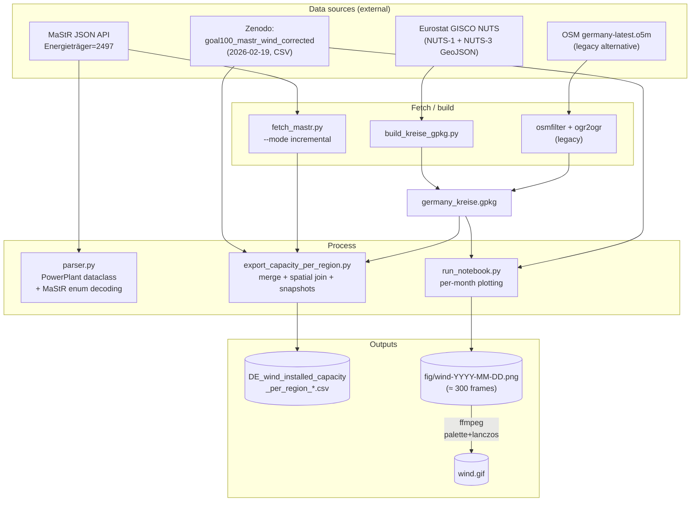
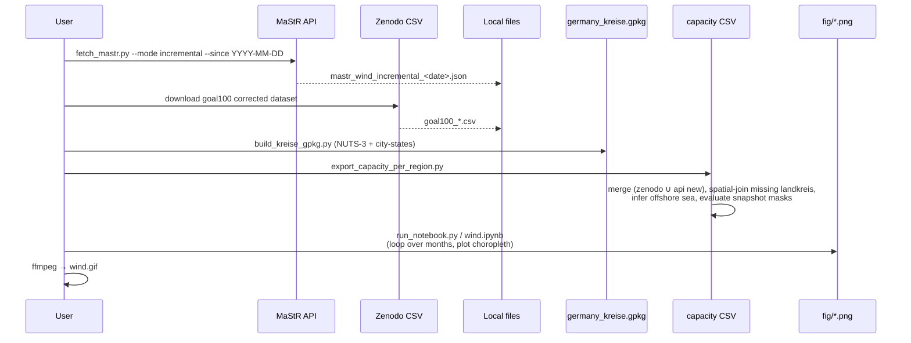
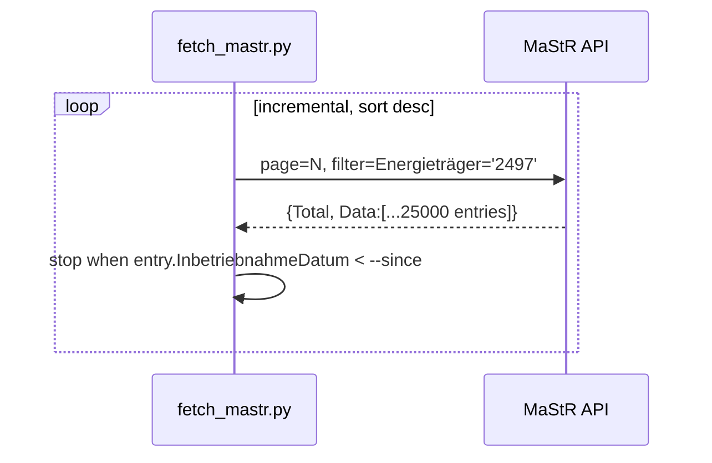
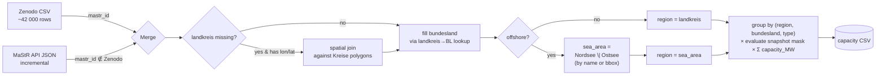

# Marktstammdatenregister Plotter — DE Wind

Choropleth maps and per-region capacity tables for **every wind turbine installed in Germany**, built from the [Marktstammdatenregister (MaStR)](https://www.marktstammdatenregister.de) — Germany's official register of every electricity-generating unit on the grid.

The pipeline merges a curated Zenodo snapshot (~2026-02-19) with the live MaStR JSON API for incremental updates, joins coordinates against NUTS-3 / OSM administrative boundaries, and renders one map per month from 2000 → today. Those frames stitch into the GIF at the top of the repo.

> **Caution** — This is research-quality code: it needs to run exactly once, much of it is AI-generated and verbose in random places, and almost nothing has been cleaned up. Use it as a recipe, not a library.

---

## At a glance

| Property | Value |
| --- | --- |
| **Country** | Germany 🇩🇪 |
| **Energy type** | Onshore + offshore wind |
| **Spatial unit** | 401 NUTS-3 *Kreise* (incl. Berlin/Hamburg/Bremen as city-states) + 2 sea areas (Nordsee, Ostsee) |
| **Time coverage** | First commissioning ≈ 1980s → today, monthly frames from 2000-01 |
| **Records** | ≈ 42,000 wind units (Windenergie, MaStR `Energieträger=2497`) |
| **Latest installed capacity** | **78.55 GW** across 313 regions |
| **Output formats** | PNG frames, animated GIF, per-region CSV |

### Capacity totals by snapshot

| Snapshot | MW | GW |
|---:|---:|---:|
| 2013-12-31 | 28,843.8 | **28.84** |
| 2024-12-31 | 71,999.6 | **72.00** |
| 2025-12-31 | 77,818.9 | **77.82** |
| Latest (today) | 78,553.2 | **78.55** |

### Capacity by Bundesland (latest)

```text
Niedersachsen           14,125.0 MW  ███████████████████████████████████ 18.0%
Schleswig-Holstein       9,684.8 MW  ████████████████████████ 12.3%
Brandenburg              9,561.7 MW  ████████████████████████ 12.2%
Nordrhein-Westfalen      9,255.7 MW  ███████████████████████ 11.8%
Nordsee  (offshore)      8,178.9 MW  ████████████████████ 10.4%
Sachsen-Anhalt           5,777.6 MW  ██████████████  7.4%
Rheinland-Pfalz          4,318.6 MW  ███████████  5.5%
Mecklenburg-Vorpommern   3,937.8 MW  ██████████  5.0%
Hessen                   2,810.3 MW  ███████  3.6%
Bayern                   2,766.0 MW  ███████  3.5%
Baden-Württemberg        2,084.1 MW  █████  2.7%
Thüringen                1,905.2 MW  █████  2.4%
Ostsee   (offshore)      1,828.2 MW  █████  2.3%
Sachsen                  1,425.1 MW  ████  1.8%
Saarland                   564.6 MW  █  0.7%
Bremen                     191.1 MW  ▏ 0.2%
Hamburg                    121.7 MW  ▏ 0.2%
Berlin                      16.6 MW  ▏ 0.0%
```

> Northern Germany dominates: the four Länder along the North Sea / Baltic coast plus Nordsee offshore make up ≈ 65 % of all installed capacity. Southern Germany (BY/BW) is wind-poor — wind there has historically been blocked by the *10H* setback rule and Alpine topography.

---

## Pipeline



### Stage-by-stage flow



---

## Repository contents

| File | Type | What it does |
|---|---|---|
| [`fetch_mastr.py`](fetch_mastr.py) | Fetcher | Hits the MaStR JSON API (`GetErweiterteOeffentlicheEinheitStromerzeugung`). Two modes: **full** (all pages) and **incremental** (sort desc by `InbetriebnahmeDatum`, stop at cutoff). 25k entries / page, 2 s sleep, single energy type per call. |
| [`parser.py`](parser.py) | Parser | `PowerPlant` dataclass + `from_json()` that decodes MaStR's enum-as-int vocabulary (orientation, tilt, installation type, building usage, offshore sea). Also parses the `/Date(ms)/` .NET-JSON date format. |
| [`export_wind_csv.py`](export_wind_csv.py) | Exporter | Loads parsed power plants, filters `energy_type == "Wind"`, writes `wind_data.csv`. |
| [`export_capacity_per_region.py`](export_capacity_per_region.py) | Aggregator | **Core merge**: Zenodo + API → de-duplicate by `mastr_id` → spatial-join missing landkreise → infer offshore sea → evaluate active-on-snapshot mask → group by region → wide-format CSV with one capacity column per snapshot. |
| [`build_kreise_gpkg.py`](build_kreise_gpkg.py) | GIS builder | Downloads Eurostat GISCO NUTS-3 (≈ Kreise) + NUTS-1 city-states (Berlin, Hamburg, Bremen) and writes `germany_kreise.gpkg`. Replaces the old osmfilter/ogr2ogr pipeline. |
| [`run_notebook.py`](run_notebook.py) | Plotter (script) | Headless re-implementation of the notebook: load → spatial join → choropleth with Natural Breaks (`mapclassify`, k=8) → save PNG. |
| [`wind.ipynb`](wind.ipynb) | Plotter (notebook) | Interactive version with the loop over all months. |
| [`germany_kreise.gpkg`](germany_kreise.gpkg) | Geo | NUTS-3 + city-states, EPSG:4326. |
| [`DE_wind_installed_capacity_per_region_Zenodo_*.csv`](DE_wind_installed_capacity_per_region_Zenodo_2026-02-19_API_2026-03-04.csv) | Output | 313 regions × {region, bundesland, type, turbines, capacity_MW per snapshot}. |
| [`fig/`](fig/) | Output | One PNG per (year, month) — ~315 frames. |

---

## Data sources in detail

<details>
<summary><b>1. Zenodo "goal100" corrected MaStR wind dataset (primary)</b></summary>

- **DOI**: [10.5281/zenodo.18697247](https://doi.org/10.5281/zenodo.18697247)
- **Cutoff**: 2026-02-19
- **Why use it over the raw API?** The Zenodo set has manual corrections (geocoding fixes, removal of duplicate entries, offshore re-labeling) that the raw MaStR has known to mis-record.
- **Schema (relevant cols)**: `einheit_mastr_nummer`, `datum_inbetriebnahme`, `datum_endgueltige_stilllegung`, `nettonennleistung` (kW), `einheit_betriebsstatus`, `landkreis`, `bundesland`, `lon_x`, `lat_y`, `wind_an_land_oder_auf_see`.

</details>

<details>
<summary><b>2. MaStR JSON API (incremental top-up)</b></summary>

- **Endpoint**: `https://www.marktstammdatenregister.de/MaStR/Einheit/EinheitJson/GetErweiterteOeffentlicheEinheitStromerzeugung`
- **Filter**: `Energieträger~eq~'2497'` for wind. (`2495` = solar, `2496` = solar excluded, etc.)
- **Pagination**: 25 000 / page. Wind ≈ 2 pages; **solar would be ~237 pages** — only fetch solar in incremental mode.
- **Date format**: .NET-JSON `/Date(milliseconds_utc)/` — see `parse_dotnet_date()` in `parser.py:16` and `fetch_mastr.py:56`.
- **Why scrape JSON instead of XML?** The official XML export is the canonical bulk source, but the API JSON is pre-filtered, schemaful, and gives ~42k wind rows in two HTTP calls.



</details>

<details>
<summary><b>3. Administrative boundaries (NUTS-3 / Kreise)</b></summary>

Two equivalent paths, pick one:

**Modern path (default)** — `build_kreise_gpkg.py`:
```bash
python build_kreise_gpkg.py
# downloads Eurostat GISCO NUTS_RG_01M_2021_4326_LEVL_3 + LEVL_1
# writes germany_kreise.gpkg with admin_level=6 Kreise
# + admin_level=4 city-states (Berlin / Hamburg / Bremen)
```

**Legacy path (OSM)** — produces the same file, kept for reproducibility:
```bash
osmfilter germany-latest.o5m \
  --keep-nodes="boundary=administrative and ( admin_level=6 or admin_level=4 )" \
  --keep-ways="boundary=administrative and ( admin_level=6 or admin_level=4 )" \
  --keep-relations="boundary=administrative and ( admin_level=6 or admin_level=4 )" \
  --drop-version --drop-author \
  -o=germany_admin_levels_4_6.osm

ogr2ogr -f GPKG germany_kreise.gpkg germany_admin_levels_4_6.osm \
  -sql "SELECT name, admin_level, boundary FROM multipolygons \
        WHERE boundary='administrative' AND \
              (admin_level='6' OR \
               (admin_level='4' AND name IN ('Berlin','Hamburg','Bremen')))" \
  -nlt MULTIPOLYGON -overwrite -nln multipolygons
```

</details>

---

## Key data structures

### `PowerPlant` (after enum decoding) — see [`parser.py`](parser.py)

| Field | Type | Notes |
|---|---|---|
| `id` | `int` | MaStR `Id` |
| `power` | `float` | `Bruttoleistung` (kW) — gross |
| `inverter` | `float` | Net derated by `Leistungsbegrenzung` (50/60/70 % caps for some PV; passthrough for wind) |
| `install_date` | `datetime\|None` | UTC, parsed from `/Date(ms)/` |
| `removal_date` | `datetime\|None` | Final decommissioning |
| `postal_code` | `str` | `Plz` |
| `is_private` | `bool` | `AnlagenbetreiberPersonenArt == 518` |
| `facing` | `int\|str\|None` | Compass deg, or `"tracked"` / `"east-west"` |
| `tilt` | `tuple[int,int]\|str\|None` | Range in deg, or `"tracked"` / 90 (façade) |
| `installation_type` | `str\|None` | `building` / `building_other` / `free` / `water` / `parking_lot` / `balkonkraftwerk` |
| `building_type` | `str\|None` | `commercial` / `household` / `industry` / `farming` / `public` / `other` |
| `energy_type` | `str` | `EnergietraegerName` (e.g. "Wind") |
| `longitude`, `latitude` | `float` | EPSG:4326 |
| `off_shore` | `str\|None` | `"Nordsee"` / `"Ostsee"` / None |

### Per-region capacity CSV — output of [`export_capacity_per_region.py`](export_capacity_per_region.py)

| Column | Type | Description |
|---|---|---|
| `region` | str | NUTS-3 *Kreis* name **or** `Nordsee` / `Ostsee` for offshore |
| `bundesland` | str | German federal state, or sea name for offshore (self-referential by design) |
| `type` | enum | `land` \| `offshore` |
| `turbines` | int | Active turbine count *as of latest snapshot* |
| `capacity_MW_2013` | float | Σ installed MW active on 2013-12-31 |
| `capacity_MW_2024` | float | Σ installed MW active on 2024-12-31 |
| `capacity_MW_2025` | float | Σ installed MW active on 2025-12-31 |
| `capacity_MW_latest` | float | Σ installed MW active *today* (no removal-date threshold) |

**Active-on-snapshot rule** (see `is_active_on()` in `export_capacity_per_region.py:206`):
```
active = (install_date ≤ snapshot)
       ∧ (removal_date is NaT  OR  removal_date > snapshot)
       ∧ (status ∉ {"Endgültig stillgelegt","Vorübergehend stillgelegt"})
```

---

## Top 10 regions, latest snapshot

| Rank | Region | Bundesland | Type | Turbines | MW |
|---:|---|---|---|---:|---:|
| 1 | Nordfriesland | Schleswig-Holstein | land | 861 | 2,566.1 |
| 2 | Dithmarschen | Schleswig-Holstein | land | 835 | 2,361.7 |
| 3 | Uckermark | Brandenburg | land | 682 | 1,757.9 |
| 4 | Schleswig-Flensburg | Schleswig-Holstein | land | 504 | 1,470.6 |
| … | (see CSV) | | | | |

---

## Usage

### Install

Uses GeoPandas, pandas, mapclassify, matplotlib, requests. With pixi:

```bash
pixi add geopandas pandas mapclassify matplotlib requests pyogrio shapely
```

### One-shot reproduce everything

```bash
# 1. Build admin boundaries
python build_kreise_gpkg.py

# 2. Top up MaStR with anything new since the Zenodo cutoff
python fetch_mastr.py --energy wind --mode incremental --since 2026-02-19

# 3. Build the per-region capacity CSV (Zenodo + API)
python export_capacity_per_region.py

# 4. Plot one frame (or run wind.ipynb for the monthly loop)
python run_notebook.py
```

### Animate frames into a GIF

The notebook saves `fig/wind-YYYY-MM-DD.png`. Stitching them needs renaming to `frame%03d.png` because ffmpeg can't glob arbitrary patterns reliably:

```fish
set -l file wind
set -l frames_to_repeat 120
mktemp -d | read -l temp_dir
and cp "$file"-*.png $temp_dir
and begin
    set -l i 1
    set -l last_frame_path ""
    for f in (ls "$temp_dir/$file"*.png | sort)
        mv $f (printf "%s/frame%03d.png" $temp_dir $i)
        set last_frame_path (printf "%s/frame%03d.png" $temp_dir $i)
        set i (math $i + 1)
    end
    set -l current_duplicate_index $i
    for j in (seq 1 $frames_to_repeat)
        cp "$last_frame_path" (printf "%s/frame%03d.png" $temp_dir $current_duplicate_index)
        set current_duplicate_index (math $current_duplicate_index + 1)
    end
end
and ffmpeg -framerate 30 -i "$temp_dir/frame%03d.png" \
    -vf "scale=-1:1200:flags=lanczos,split[s0][s1];[s0]palettegen[p];[s1][p]paletteuse=dither=none" \
    -loop 0 -y "$file".gif
and rm -rf "$temp_dir"
```

> **Why so convoluted?** PNG has no built-in timestamp metadata, so ffmpeg can't infer ordering — it needs a strictly numbered filename pattern. The 120-frame end-pad makes the GIF "rest" on the final state. With JPEG + EXIF this would be a one-liner.

---

## How merge & dedup actually work



### Edge cases handled
- **Missing `bundesland` on API entries** → looked up from `landkreis` (Zenodo provides the lookup).
- **Missing `landkreis` on API entries** with valid lon/lat → spatial join against `germany_kreise.gpkg`.
- **Offshore turbines** with `bundesland = "Niedersachsen, Küstenmeer"` → re-labeled `Nordsee`.
- **Offshore turbines** with no `bundesland` at all → bbox check on lon/lat to pick `Nordsee` vs. `Ostsee`.
- **Decommissioned turbines** → excluded from a snapshot if `status ∈ {Endgültig stillgelegt, Vorübergehend stillgelegt}` or `removal_date ≤ snapshot`.

---

## Caveats

- **Research-quality code**: scripts are imperative top-level, no tests, paths hard-coded relative to repo root.
- **API rate-limiting**: 2-second sleep between pages; full-mode for solar is ~237 pages and will get throttled.
- **Coordinate precision**: MaStR redacts coords for small private installations (`StandortAnonymisiert`) — those rows are dropped from the spatial join.
- **Removal dates are sparse**: many old turbines lack a `datum_endgueltige_stilllegung`; we treat NaT as "still active". This slightly inflates older snapshots.
- **City-states**: Berlin/Hamburg/Bremen are NUTS-1, not NUTS-3 — handled as `admin_level=4` so they appear as a single polygon, not subdivided.

## License & attribution

- Code: see repo header.
- MaStR data: © Bundesnetzagentur — open data, CC BY 4.0.
- Zenodo "goal100" curated dataset: cite [10.5281/zenodo.18697247](https://doi.org/10.5281/zenodo.18697247).
- NUTS boundaries: © EuroGeographics / Eurostat GISCO.
